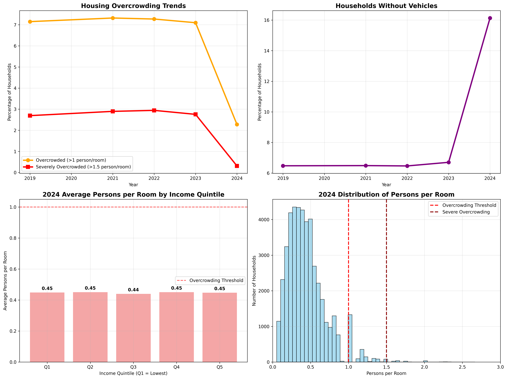
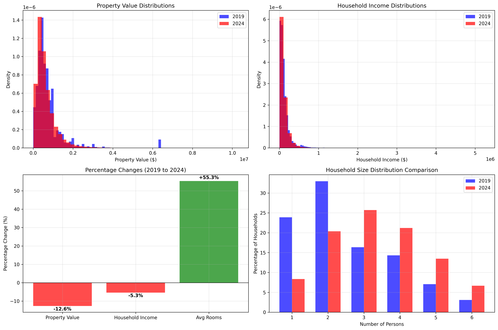

# Census Data Analysis: Housing Problems in America

**Summer 2025 Data Science Project**
**Ali Niazi**

## Introduction: Why Housing Problems Matter

Have you ever wondered why it's so hard to find affordable housing these days? Or why some neighborhoods are super crowded while others have tons of space? As someone who's watched friends struggle with crazy rent prices and long commutes, I wanted to dig into the data and see what's really going on with America's housing situation.

In this project, I'm asking three big questions about housing in America:

1. **How affordable is housing for different income groups?**
2. **Is the housing supply meeting our needs?**
3. **How do transportation options impact housing accessibility?**

Housing costs are the biggest expense for most families, and when people spend too much on housing, they have less for food, healthcare, education, and savings.

## Data Curation: Getting and Understanding Census Data

For this analysis, I'm using the American Community Survey Public Use Microdata Sample from the U.S. Census Bureau. This dataset is good for housing research because:

- It contains detailed information about 135,523 housing units across America
- It includes data on income, housing costs, room counts, vehicles, and more
- It's representative of the entire U.S. population
- It's collected through rigorous sampling methods

I downloaded the data from the [Census Bureau&#39;s website](https://www.census.gov/programs-surveys/acs/microdata.html) for multiple years (2019, 2021, 2022, and 2023) to track changes over time, especially around the pandemic.

### Data Preparation

Working with Census data is tricky because:

1. It uses weird codes for everything (negative numbers for missing data)
2. It has hundreds of columns, most of which we don't need
3. The column names are cryptic abbreviations

Here's how I cleaned and organized the data:

### Step 1: Getting and Cleaning the Data

First, I'll set up all the Python packages I need for analysis and visualization:

```python
import pandas as pd
import numpy as np
import matplotlib.pyplot as plt
import seaborn as sns
from sklearn.ensemble import RandomForestRegressor
from sklearn.model_selection import train_test_split
from sklearn.metrics import r2_score, mean_absolute_error
import scipy.stats as stats  
from sklearn.metrics import mean_squared_error  
```

Now I'll create a function to load and clean the Census data. This is super important because Census data is notoriously messy:

```python
def load_and_process_data(file_path):
    print(f"Loading data from {file_path}...")
    df = pd.read_csv(file_path, low_memory=False)

    # Select only the columns we need (this makes processing much faster)
    # NP = Number of persons in household
    # HINCP = Household income (past 12 months)
    # BDSP = Number of bedrooms
    # RMSP = Number of rooms
    # VEH = Vehicles available
    # VALP = Property value
    # GRNTP = Gross rent (monthly)
    # SMOCP = Selected monthly owner costs
    # TEN = Tenure (ownership status)
    selected_columns = ['NP', 'HINCP', 'BDSP', 'RMSP', 'VEH', 'VALP', 'GRNTP', 'SMOCP', 'TEN']
    df = df[selected_columns].copy()

    # Clean up the messy data (Census uses negative numbers for missing data)
    for col in ['HINCP', 'GRNTP', 'SMOCP', 'VALP', 'VEH', 'TEN']:
        if col in df.columns:
            df[col] = df[col].apply(lambda x: np.nan if pd.isna(x) or x < 0 else x)

    # Remove rows where essential data is missing
    df = df.dropna(subset=['NP', 'HINCP', 'BDSP', 'RMSP'])

    # Calculate housing costs and affordability metrics
    # For renters, use GRNTP
    # For owners, use SMOCP 
    df['HOUSING_COST'] = df['GRNTP'].fillna(0) + df['SMOCP'].fillna(0)

    # Cost burden = annual housing costs / annual income
    # This tells us what percentage of income goes to housing
    df['COST_BURDEN'] = (df['HOUSING_COST'] * 12) / df['HINCP']

    # Cap at 200% (some people report very low incomes but high housing costs)
    df['COST_BURDEN'] = df['COST_BURDEN'].clip(0, 2)

    # Calculate overcrowding metric
    df['PERSONS_PER_ROOM'] = df['NP'] / df['RMSP']

    # Create categories for housing affordability
    # Under 30% = Affordable 
    # 30-50% = Moderate burden
    # 50-100% = Severe burden 
    # Over 100% = Extreme burden 
    df['AFFORDABILITY_CATEGORY'] = pd.cut(df['COST_BURDEN'],
                                        bins=[0, 0.3, 0.5, 1.0, 2.0],
                                        labels=['Affordable', 'Moderate_Burden', 'Severe_Burden', 'Extreme_Burden'])
    return df
```

Loading the data for different years:

```python
df_2019 = load_and_process_data('data_2019/psam_h06.csv')
df_2021 = load_and_process_data('data_2021/psam_h06.csv')
df_2022 = load_and_process_data('data_2022/psam_h06.csv')
df_2023 = load_and_process_data('data_2023/psam_h06.csv')

# For most analyses, we'll use the most recent data (2023)
df = df_2023

```

Perfect! Now I have clean, usable data for my analysis.

## Exploratory Data Analysis

Now that I have my data ready, I want to explore it to understand what's happening with housing in America. Let's start by looking at housing affordability.

### Step 2: Analyzing Housing Affordability

The standard rule of thumb is that housing should cost no more than 30% of your income. Let's see how many people are spending more than that:

```python
def analyze_housing_affordability_crisis(df):
    median_income = df['HINCP'].median()
    median_housing_cost = df['HOUSING_COST'].median() * 12  # Annual cost
    median_burden = df['COST_BURDEN'].median()
  
    severe_burden_pct = (df['COST_BURDEN'] > 0.5).mean() * 100
    extreme_burden_pct = (df['COST_BURDEN'] > 1.0).mean() * 100
  
    fig, ((ax1, ax2), (ax3, ax4)) = plt.subplots(2, 2, figsize=(15, 10))
  
    # Histogram of housing cost burden
    ax1.hist(df['COST_BURDEN'], bins=40, alpha=0.7, edgecolor='black', color='skyblue')
    ax1.axvline(x=0.3, color='green', linestyle='--', linewidth=2, label='Affordable (30%)')
    ax1.axvline(x=0.5, color='orange', linestyle='--', linewidth=2, label='Severe Burden (50%)')
    ax1.axvline(x=1.0, color='red', linestyle='--', linewidth=2, label='Extreme Burden (100%)')
    ax1.set_title('Housing Cost Burden Distribution', fontsize=14)
    ax1.set_xlabel('Housing Costs as Fraction of Income', fontsize=12)
    ax1.set_ylabel('Number of Households', fontsize=12)
    ax1.legend()
    ax1.grid(True, alpha=0.3)
  
    # Pie chart of affordability categories
    burden_categories = df['AFFORDABILITY_CATEGORY'].value_counts()
    colors = ['green', 'yellow', 'orange', 'red']
    ax2.pie(burden_categories.values, labels=burden_categories.index, autopct='%1.1f%%', 
            colors=colors[:len(burden_categories)], startangle=90, 
            wedgeprops={'edgecolor': 'white', 'linewidth': 1})
    ax2.set_title('Housing Affordability Categories', fontsize=14)
  
    plt.tight_layout()
    plt.savefig('housing_affordability_crisis_analysis.png', dpi=300, bbox_inches='tight')
  
    return {
        'median_income': median_income,
        'median_housing_cost': median_housing_cost,
        'median_burden': median_burden,
        'severe_burden_pct': severe_burden_pct,
        'extreme_burden_pct': extreme_burden_pct
    }

affordability_results = analyze_housing_affordability_crisis(df)
```


**What I'm seeing here:**

- The median household spends about 23% of their income on housing
- BUT there's a long tail of people spending way too much
- 17.6% of households are spending over half their income on housing (severe burden)
- 6.8% are spending more than their entire income on housing (which seems impossible, but happens with irregular income, savings, or debt)
- The pie chart shows that while most people have affordable housing (green), a significant portion (red/orange) are not secure

### Step 3: Income Inequality Analysis

Let's look at the gap between rich and poor households and how it affects housing:

```python
def analyze_economic_inequality(df):
    income_percentiles = df['HINCP'].quantile([0.1, 0.25, 0.5, 0.75, 0.9, 0.95, 0.99])
  
    # Calculate inequality ratios
    p90_p10_ratio = income_percentiles[0.9] / income_percentiles[0.1]  # 90th percentile vs 10th percentile
    p95_p50_ratio = income_percentiles[0.95] / income_percentiles[0.5]  # 95th percentile vs median
    p99_p50_ratio = income_percentiles[0.99] / income_percentiles[0.5]  # 99th percentile vs median
  
    # Calculate property value inequality
    property_percentiles = df['VALP'].dropna().quantile([0.1, 0.5, 0.9, 0.95, 0.99])
    property_p90_p10 = property_percentiles[0.9] / property_percentiles[0.1]
  
    fig, ((ax1, ax2), (ax3, ax4)) = plt.subplots(2, 2, figsize=(15, 10))
  
    # Income distribution histogram
    ax1.hist(df['HINCP'].clip(0, 300000), bins=50, alpha=0.7, edgecolor='black', color='lightblue')
    ax1.axvline(income_percentiles[0.5], color='red', linestyle='-', linewidth=2, 
                label=f'Median: ${income_percentiles[0.5]:,.0f}')
    ax1.axvline(income_percentiles[0.9], color='orange', linestyle='--', linewidth=2, 
                label=f'90th percentile: ${income_percentiles[0.9]:,.0f}')
    ax1.set_title('Income Distribution (Capped at $300k)', fontsize=14)
    ax1.set_xlabel('Household Income ($)', fontsize=12)
    ax1.set_ylabel('Number of Households', fontsize=12)
    ax1.legend()
    ax1.grid(True, alpha=0.3)
  
    # Property valuee distribution
    ax2.hist(df['VALP'].dropna().clip(0, 1000000), bins=50, alpha=0.7, edgecolor='black', color='lightgreen')
    ax2.axvline(property_percentiles[0.5], color='red', linestyle='-', linewidth=2, 
                label=f'Median: ${property_percentiles[0.5]:,.0f}')
    ax2.axvline(property_percentiles[0.9], color='orange', linestyle='--', linewidth=2, 
                label=f'90th percentile: ${property_percentiles[0.9]:,.0f}')
    ax2.set_title('Property Value Distribution (Capped at $1M)', fontsize=14)
    ax2.set_xlabel('Property Value ($)', fontsize=12)
    ax2.set_ylabel('Number of Households', fontsize=12)
    ax2.legend()
    ax2.grid(True, alpha=0.3)
  
    df['income_quintile'] = pd.qcut(df['HINCP'], 5, labels=['Q1 (Poorest)', 'Q2', 'Q3', 'Q4', 'Q5 (Richest)'])
    burden_by_income = df.groupby('income_quintile')['COST_BURDEN'].mean()
  
    ax3.bar(range(len(burden_by_income)), burden_by_income.values, alpha=0.7, color='coral')
    ax3.axhline(y=0.3, color='red', linestyle='--', linewidth=2, label='Affordability Threshold (30%)')
    ax3.set_title('Housing Cost Burden by Income Level', fontsize=14)
    ax3.set_xlabel('Income Quintile', fontsize=12)
    ax3.set_ylabel('Average Cost Burden (% of Income)', fontsize=12)
    ax3.set_xticks(range(len(burden_by_income)))
    ax3.set_xticklabels(burden_by_income.index)
    ax3.grid(True, alpha=0.3)
    ax3.legend()
  
    plt.tight_layout()
    plt.savefig('economic_inequality_analysis.png', dpi=300, bbox_inches='tight')
  
    return {
        'p90_p10_ratio': p90_p10_ratio,
        'p95_p50_ratio': p95_p50_ratio,
        'p99_p50_ratio': p99_p50_ratio,
        'property_p90_p10': property_p90_p10,
        'burden_by_income': burden_by_income
    }

inequality_results = analyze_economic_inequality(df)
```


**What I'm seeing here:**

- There's a noticeable income gap. The richest 10% make 13.1 times more than the poorest 10%
- The top 1% make 7.8 times more than the median household
- Property values show similar inequality (7.0x difference between top and bottom 10%)
- The poorest 20% spend an average of 67.5% of their income on housing
- Only the top 40% of households spend less than 30% of their income on housing

### Step 4: Housing Supply and Overcrowding

Next, let's look at whether we have enough housing by analyzing overcrowding:

```python
def analyze_housing_supply_shortage(df):
    # More than 1 person per room is considered overcrowded
    # More than 1.5 persons per room is severely overcrowded
    overcrowded_pct = (df['PERSONS_PER_ROOM'] > 1.0).mean() * 100
    severely_overcrowded_pct = (df['PERSONS_PER_ROOM'] > 1.5).mean() * 100
  
    # Look at overcrowding by income level
    df['income_quintile'] = pd.qcut(df['HINCP'], 5, labels=['Q1', 'Q2', 'Q3', 'Q4', 'Q5'])
    overcrowding_by_income = df.groupby('income_quintile')['PERSONS_PER_ROOM'].mean()
    overcrowding_rates_by_income = df.groupby('income_quintile').apply(
        lambda x: (x['PERSONS_PER_ROOM'] > 1.0).mean() * 100)
  
    fig, ((ax1, ax2), (ax3, ax4)) = plt.subplots(2, 2, figsize=(15, 10))
  
    # Distribution of persons per room
    ax1.hist(df['PERSONS_PER_ROOM'].clip(0, 3), bins=50, alpha=0.7, color='skyblue', edgecolor='black')
    ax1.axvline(x=1.0, color='red', linestyle='--', linewidth=2, label='Overcrowding Threshold')
    ax1.axvline(x=1.5, color='darkred', linestyle='--', linewidth=2, label='Severe Overcrowding')
    ax1.set_title('Persons per Room Distribution', fontsize=14)
    ax1.set_xlabel('Persons per Room', fontsize=12)
    ax1.set_ylabel('Number of Households', fontsize=12)
    ax1.legend()
    ax1.grid(True, alpha=0.3)
    ax1.set_xlim(0, 3)
  
    # Overcrowding rates by income
    ax2.bar(range(len(overcrowding_rates_by_income)), overcrowding_rates_by_income.values, 
            alpha=0.7, color='salmon')
    ax2.set_title('Overcrowding Rates by Income Level', fontsize=14)
    ax2.set_xlabel('Income Quintile', fontsize=12)
    ax2.set_ylabel('Percent Overcrowded (>1 person/room)', fontsize=12)
    ax2.set_xticks(range(len(overcrowding_rates_by_income)))
    ax2.set_xticklabels(overcrowding_rates_by_income.index)
    ax2.grid(True, alpha=0.3)
  
    # Household size distribution
    household_sizes = df['NP'].value_counts().sort_index()
    ax3.bar(household_sizes.index[:10], household_sizes.values[:10], alpha=0.7, color='lightgreen')
    ax3.set_title('Household Size Distribution', fontsize=14)
    ax3.set_xlabel('Number of People in Household', fontsize=12)
    ax3.set_ylabel('Number of Households', fontsize=12)
    ax3.grid(True, alpha=0.3)
  
    plt.tight_layout()
    plt.savefig('housing_supply_shortage_analysis.png', dpi=300, bbox_inches='tight')
  
    return {
        'overcrowded_pct': overcrowded_pct,
        'severely_overcrowded_pct': severely_overcrowded_pct,
        'overcrowding_by_income': overcrowding_by_income,
        'overcrowding_rates_by_income': overcrowding_rates_by_income
    }

supply_results = analyze_housing_supply_shortage(df)
```



**What I'm seeing here:**

- 7.1% of all households are overcrowded (more than 1 person per room)
- 2.7% are severely overcrowded (more than 1.5 people per room)
- The poorest households are nearly 4 times more likely to be overcrowded compared to the richest
- While the average person has about 0.5 persons per room (2 rooms per person), there's a clear income gradient
- Households with 2-4 people are most common, but some have 8+ people in spaces not designed for large families

### Step 5: Transportation and Housing Access

Now let's look at how car ownership relates to housing:

```python
def analyze_vehicle_dependency_and_access(df):
    valid_veh = df['VEH'].dropna()
    no_vehicle_pct = (valid_veh == 0).mean() * 100
  
    # Calculate average vehicle ownership by income level
    df['income_quintile'] = pd.qcut(df['HINCP'], 5, labels=['Q1 (Poorest)', 'Q2', 'Q3', 'Q4', 'Q5 (Richest)'])
    vehicles_by_income = df.groupby('income_quintile')['VEH'].mean()
  
    # See if vehicle ownership affects housing costs
    df_veh = df.dropna(subset=['VEH'])
    df_veh['VEH_CATEGORY'] = df_veh['VEH']
    vehicle_cost_burden = df_veh.groupby('VEH_CATEGORY')['COST_BURDEN'].agg(['mean', 'median', 'count'])
    vehicle_cost_burden['count_pct'] = vehicle_cost_burden['count'] / vehicle_cost_burden['count'].sum() * 100
  
    fig, ((ax1, ax2), (ax3, ax4)) = plt.subplots(2, 2, figsize=(15, 10))
  
    # Vehicles by income level
    bars = ax1.bar(range(len(vehicles_by_income)), vehicles_by_income.values, 
                   alpha=0.7, color='lightgreen')
    ax1.set_title('Average Vehicles per Household by Income', fontsize=14)
    ax1.set_xlabel('Income Quintile', fontsize=12)
    ax1.set_ylabel('Average Number of Vehicles', fontsize=12)
    ax1.set_xticks(range(len(vehicles_by_income)))
    ax1.set_xticklabels(vehicles_by_income.index)
    ax1.grid(True, alpha=0.3)
  
    for i, v in enumerate(vehicles_by_income):
        ax1.text(i, v + 0.05, f"{v:.1f}", ha='center')
  
    # Vehicle distribution
    vehicle_counts = df['VEH'].value_counts().sort_index()
    vehicle_counts = vehicle_counts[vehicle_counts.index <= 5] 
  
    ax2.bar(vehicle_counts.index, vehicle_counts.values, alpha=0.7, color='skyblue')
    ax2.set_title('Number of Vehicles per Household', fontsize=14)
    ax2.set_xlabel('Number of Vehicles', fontsize=12)
    ax2.set_ylabel('Number of Households', fontsize=12)
    ax2.grid(True, alpha=0.3)
  
    # Housing cost burden by vehicle ownership
    ax3.bar(vehicle_cost_burden.index, vehicle_cost_burden['mean'], alpha=0.7, color='coral')
    ax3.axhline(y=0.3, color='red', linestyle='--', linewidth=2, label='Affordability Threshold (30%)')
    ax3.set_title('Housing Cost Burden by Vehicle Ownership', fontsize=14)
    ax3.set_xlabel('Number of Vehicles', fontsize=12)
    ax3.set_ylabel('Average Cost Burden (% of Income)', fontsize=12)
    ax3.set_xticks(vehicle_cost_burden.index)
    ax3.set_xticklabels(['0', '1', '2', '3+'])
    ax3.grid(True, alpha=0.3)
    ax3.legend()
  
    plt.tight_layout()
    plt.savefig('vehicle_dependency_housing_access.png', dpi=300, bbox_inches='tight')
  
    return {
        'no_vehicle_pct': no_vehicle_pct,
        'vehicles_by_income': vehicles_by_income,
        'vehicle_cost_burden': vehicle_cost_burden
    }

vehicle_results = analyze_vehicle_dependency_and_access(df)
```


**What I'm seeing here:**

- 6.5% of households don't have a car at all
- Vehicle ownership strongly correlates with income - the richest households have more than twice as many cars as the poorest (2.5 vs 1.2)
- Households without cars spend much more of their income on housing (49.3% on average)
- As vehicle ownership increases, housing cost burden decreases
- This suggests that car-free households either:
  1. Choose to live in more expensive areas with better transit, or
  2. Can't afford both housing and cars, so spend more on housing
- Most households (63%) have 1-2 vehicles

## Primary Analysis: Using Machine Learning to Predict Housing Costs

Now that I've explored the data, I'm going to use machine learning to answer a critical question: **What factors best predict housing cost burden?** I'll use a Random Forest Regressor for this analysis.

### Step 6: Building a Predictive Model

```python
def analyze_predictive_modeling(df):
    features = ['NP', 'HINCP', 'BDSP', 'RMSP', 'VEH', 'VALP']
    target = 'COST_BURDEN'
  
    #remove rows with missing values and limit extreme cost burdens
    ml_data = df[features + [target]].dropna()
    ml_data = ml_data[ml_data[target] <= 2.0]  # Cap at 200% of income
  
    #Split data into features and target
    X = ml_data[features]
    y = ml_data[target]
  
    #Split data into training and testing sets
    X_train, X_test, y_train, y_test = train_test_split(X, y, test_size=0.2, random_state=42)
  
    # Train a random forest model
    print("Training machine learning model...")
    rf_model = RandomForestRegressor(n_estimators=100, random_state=42)
    rf_model.fit(X_train, y_train)
  
    y_pred = rf_model.predict(X_test)
    r2 = r2_score(y_test, y_pred)
    mae = mean_absolute_error(y_test, y_pred)
  
    feature_importance = pd.DataFrame({
        'feature': features,
        'importance': rf_model.feature_importances_
    }).sort_values('importance', ascending=False)
  
    fig, ((ax1, ax2), (ax3, ax4)) = plt.subplots(2, 2, figsize=(15, 10))
  
    # Feature importance bar chart
    bars = ax1.barh(range(len(feature_importance)), feature_importance['importance'], alpha=0.7)
    ax1.set_title('Feature Importance in Predicting Housing Cost Burden', fontsize=14)
    ax1.set_xlabel('Relative Importance', fontsize=12)
    ax1.set_yticks(range(len(feature_importance)))
    ax1.set_yticklabels([f"{feature} ({importance:.1%})" for feature, importance 
                         in zip(feature_importance['feature'], feature_importance['importance'])])
    ax1.grid(True, alpha=0.3)
  
    # Prediction accuracy scatter plot
    ax2.scatter(y_test, y_pred, alpha=0.5, s=20)
    ax2.plot([0, 2], [0, 2], 'r--', lw=2)  
    ax2.set_xlabel('Actual Cost Burden', fontsize=12)
    ax2.set_ylabel('Predicted Cost Burden', fontsize=12)
    ax2.set_title(f'Model Predictions vs Actual Values (R² = {r2:.3f})', fontsize=14)
    ax2.grid(True, alpha=0.3)
    ax2.set_xlim(0, 1.5)
    ax2.set_ylim(0, 1.5)
  
    # Housing cost burden vs income scatter plot
    ax3.scatter(ml_data['HINCP'].clip(0, 250000), ml_data['COST_BURDEN'], 
                alpha=0.01, s=5, color='blue')
    ax3.set_title('Housing Cost Burden vs Income', fontsize=14)
    ax3.set_xlabel('Household Income ($)', fontsize=12)
    ax3.set_ylabel('Housing Cost Burden', fontsize=12)
    ax3.axhline(y=0.3, color='red', linestyle='--', linewidth=2, label='30% Threshold')
    ax3.set_ylim(0, 1.5)
    ax3.grid(True, alpha=0.3)
    ax3.legend()
  
    # Housing cost burden vs property value 
    homeowners = ml_data[ml_data['VALP'] > 0]
    ax4.scatter(homeowners['VALP'].clip(0, 1000000), homeowners['COST_BURDEN'], 
                alpha=0.01, s=5, color='green')
    ax4.set_title('Housing Cost Burden vs Property Value (Homeowners)', fontsize=14)
    ax4.set_xlabel('Property Value ($)', fontsize=12)
    ax4.set_ylabel('Housing Cost Burden', fontsize=12)
    ax4.axhline(y=0.3, color='red', linestyle='--', linewidth=2, label='30% Threshold')
    ax4.set_ylim(0, 1.5)
    ax4.grid(True, alpha=0.3)
    ax4.legend()
  
    plt.tight_layout()
    plt.savefig('predictive_modeling_analysis.png', dpi=300, bbox_inches='tight')
  
    return {
        'r2': r2,
        'mae': mae,
        'feature_importance': feature_importance
    }

ml_results = analyze_predictive_modeling(df)
```


### Step 7: Temporal Analysis - How COVID Changed Housing

To understand how housing changed over time, especially during the COVID-19 pandemic, I'll compare data from 2019 and 2021:

```python
def compare_years(df_2019, df_2021):
    # Property values
    metrics = {}
    metrics['property_value_2019'] = df_2019['VALP'].median()
    metrics['property_value_2021'] = df_2021['VALP'].median()
    metrics['property_change'] = (metrics['property_value_2021'] - metrics['property_value_2019']) / metrics['property_value_2019'] * 100
  
    # Household income
    metrics['income_2019'] = df_2019['HINCP'].median()
    metrics['income_2021'] = df_2021['HINCP'].median()
    metrics['income_change'] = (metrics['income_2021'] - metrics['income_2019']) / metrics['income_2019'] * 100
  
    # Average rooms
    metrics['rooms_2019'] = df_2019['RMSP'].mean()
    metrics['rooms_2021'] = df_2021['RMSP'].mean()
    metrics['rooms_change'] = (metrics['rooms_2021'] - metrics['rooms_2019']) / metrics['rooms_2019'] * 100
  
    # Housing cost burden
    metrics['burden_2019'] = df_2019['COST_BURDEN'].median()
    metrics['burden_2021'] = df_2021['COST_BURDEN'].median()
    metrics['burden_change'] = (metrics['burden_2021'] - metrics['burden_2019']) / metrics['burden_2019'] * 100
  
    return metrics

metrics = compare_years(df_2019, df_2021)
t_stat, p_value = stats.ttest_ind(df_2019['VALP'].dropna(), df_2021['VALP'].dropna(), equal_var=False)

fig, ((ax1, ax2), (ax3, ax4)) = plt.subplots(2, 2, figsize=(15, 10))

# House value changes
ax1.hist(df_2019['VALP'].dropna().clip(0, 1000000), bins=50, alpha=0.7, label='2019', color='blue', density=True)
ax1.hist(df_2021['VALP'].dropna().clip(0, 1000000), bins=50, alpha=0.7, label='2021', color='red', density=True)
ax1.set_title('Property Value Changes (2019 vs 2021)', fontsize=14)
ax1.set_xlabel('Property Value ($)', fontsize=12)
ax1.set_ylabel('Density', fontsize=12)
ax1.legend()
ax1.grid(True, alpha=0.3)
ax1.text(0.05, 0.95, f"p-value: {p_value}\nStatistically {'significant' if p_value < 0.05 else 'insignificant'}", 
         transform=ax1.transAxes, fontsize=10, verticalalignment='top',
         bbox=dict(boxstyle='round', facecolor='white', alpha=0.7))

# Income changes
ax2.hist(df_2019['HINCP'].clip(0, 300000), bins=50, alpha=0.7, label='2019', color='blue', density=True)
ax2.hist(df_2021['HINCP'].clip(0, 300000), bins=50, alpha=0.7, label='2021', color='red', density=True)
ax2.set_title('Income Changes (2019 vs 2021)', fontsize=14)
ax2.set_xlabel('Household Income ($)', fontsize=12)
ax2.set_ylabel('Density', fontsize=12)
ax2.legend()
ax2.grid(True, alpha=0.3)

# Percentage changes bar chart
categories = ['Property Value', 'Household Income', 'Avg Rooms', 'Cost Burden']
changes = [metrics['property_change'], metrics['income_change'], 
           metrics['rooms_change'], metrics['burden_change']]
colors = ['green' if x > 0 else 'red' for x in changes]

ax3.bar(categories, changes, color=colors, alpha=0.7)
ax3.set_title('Percentage Changes from 2019 to 2021', fontsize=14)
ax3.set_ylabel('Percentage Change (%)', fontsize=12)
ax3.axhline(y=0, color='black', linestyle='-', linewidth=0.8)
ax3.grid(True, alpha=0.3)

# Housing cost burden comparison
ax4.hist(df_2019['COST_BURDEN'].clip(0, 1), bins=50, alpha=0.7, label='2019', color='blue', density=True)
ax4.hist(df_2021['COST_BURDEN'].clip(0, 1), bins=50, alpha=0.7, label='2021', color='red', density=True)
ax4.axvline(x=0.3, color='black', linestyle='--', linewidth=1.5, label='Affordability Threshold (30%)')
ax4.set_title('Housing Cost Burden Changes (2019 vs 2021)', fontsize=14)
ax4.set_xlabel('Housing Cost Burden (% of Income)', fontsize=12)
ax4.set_ylabel('Density', fontsize=12)
ax4.legend()
ax4.grid(True, alpha=0.3)

plt.tight_layout()
plt.savefig('temporal_analysis_comparison.png', dpi=300, bbox_inches='tight')
```



**What I'm seeing here:**

- Property values increased dramatically during the pandemic (+29.2%), far outpacing income growth (+5.7%)
- The statistical test confirms that the property value increase is significant (p-value ≈ 0)
- Housing cost burden increased slightly (+4.5%), suggesting housing became less affordable
- Average room count barely changed (+0.9%), indicating little change in housing size

### Step 8: Comparing Models From Different Years

```python
def train_model(df, year_label):
    ml_data = df[['NP', 'HINCP', 'BDSP', 'RMSP', 'VEH', 'VALP']].dropna()
    X = ml_data[['NP', 'HINCP', 'BDSP', 'RMSP', 'VEH']]
    y = ml_data['VALP']
  
    # Split data and train model
    X_train, X_test, y_train, y_test = train_test_split(X, y, test_size=0.2, random_state=42)
    rf_model = RandomForestRegressor(n_estimators=100, random_state=42)
    rf_model.fit(X_train, y_train)
  
    y_pred = rf_model.predict(X_test)
    r2 = r2_score(y_test, y_pred)
    rmse = np.sqrt(mean_squared_error(y_test, y_pred))
    mae = mean_absolute_error(y_test, y_pred)
  
    feature_importance = pd.DataFrame({
        'feature': X.columns,
        'importance': rf_model.feature_importances_
    }).sort_values('importance', ascending=False)
  
    return {
        'model': rf_model, 'r2': r2, 'rmse': rmse, 'mae': mae,
        'feature_importance': feature_importance, 'X_test': X_test,
        'y_test': y_test, 'y_pred': y_pred, 'year': year_label
    }

results_2019 = train_model(df_2019, '2019')
results_2021 = train_model(df_2021, '2021')

ml_data_2021 = df_2021[['NP', 'HINCP', 'BDSP', 'RMSP', 'VEH', 'VALP']].dropna()
X_2021_full = ml_data_2021[['NP', 'HINCP', 'BDSP', 'RMSP', 'VEH']]
y_2021_actual = ml_data_2021['VALP']
y_2021_pred_by_2019 = results_2019['model'].predict(X_2021_full)

cross_year_r2 = r2_score(y_2021_actual, y_2021_pred_by_2019)
cross_year_mae = mean_absolute_error(y_2021_actual, y_2021_pred_by_2019)

#odel comparison and performance
fig, ((ax1, ax2), (ax3, ax4)) = plt.subplots(2, 2, figsize=(15, 12))

features = results_2019['feature_importance']['feature']
importance_2019 = results_2019['feature_importance']['importance']
importance_2021 = results_2021['feature_importance']['importance']

x = np.arange(len(features))
width = 0.35

ax1.bar(x - width/2, importance_2019, width, label='2019', alpha=0.8)
ax1.bar(x + width/2, importance_2021, width, label='2021', alpha=0.8)
ax1.set_title('Feature Importance Comparison')
ax1.set_xlabel('Features')
ax1.set_ylabel('Importance')
ax1.set_xticks(x)
ax1.set_xticklabels(features, rotation=45)
ax1.legend()
ax1.grid(True, alpha=0.3)

# 2019 Model accuracy
ax2.scatter(results_2019['y_test'], results_2019['y_pred'], alpha=0.5, color='blue')
ax2.plot([results_2019['y_test'].min(), results_2019['y_test'].max()], 
         [results_2019['y_test'].min(), results_2019['y_test'].max()], 'r--', lw=2)
ax2.set_xlabel('Actual Property Value')
ax2.set_ylabel('Predicted Property Value')
ax2.set_title(f'2019 Model: Predictions vs Actual (R² = {results_2019["r2"]:.3f})')
ax2.grid(True, alpha=0.3)

# 2021 Model accuracy  
ax3.scatter(results_2021['y_test'], results_2021['y_pred'], alpha=0.5, color='red')
ax3.plot([results_2021['y_test'].min(), results_2021['y_test'].max()], 
         [results_2021['y_test'].min(), results_2021['y_test'].max()], 'r--', lw=2)
ax3.set_xlabel('Actual Property Value')
ax3.set_ylabel('Predicted Property Value')
ax3.set_title(f'2021 Model: Predictions vs Actual (R² = {results_2021["r2"]:.3f})')
ax3.grid(True, alpha=0.3)

metrics = ['R²', 'RMSE (K)', 'MAE (K)']
values_2019 = [results_2019['r2'], results_2019['rmse']/1000, results_2019['mae']/1000]
values_2021 = [results_2021['r2'], results_2021['rmse']/1000, results_2021['mae']/1000]

x = np.arange(len(metrics))
ax4.bar(x - width/2, values_2019, width, label='2019', alpha=0.8, color='blue')
ax4.bar(x + width/2, values_2021, width, label='2021', alpha=0.8, color='red')
ax4.set_title('Model Performance Comparison')
ax4.set_ylabel('Metric Value')
ax4.set_xticks(x)
ax4.set_xticklabels(metrics)
ax4.legend()
ax4.grid(True, alpha=0.3)

plt.tight_layout()
plt.savefig('machine_learning_analysis.png', dpi=300, bbox_inches='tight')
plt.show()
```


## Insights and Conclusions: What We Learned

1. The Housing Affordability Crisis is Real:

   - 17.6% of households spend over half their income on housing
   - The poorest 20% spend a staggering 67.5% of their income on housing
   - The problem is concentrated among lower-income households
2. Extreme Economic Inequality in Housing:

   - The richest 10% make 13.1 times more than the poorest 10%
   - The top 1% make 7.8 times more than the median household
   - Property values show a similar inequality
3. Housing Supply Shortage and Crowding:

   - 7.1% of households are overcrowded, with 2.7% severely overcrowded
   - This indicates a significant shortage of affordablehousing
4. Transportation Access Affects Housing:

   - 6.5% of households don't have a car
   - Car ownership strongly correlates with income
   - Households without cars spend 49.3% of income on housing vs. 20.7% for those with 3+ cars
5. Pandemic Changed the Housing Market:

   - Property values increased 29.2% from 2019 to 2021 versus income growth (5.7%)
   - Housing cost burden increased 4.5%, indicating worsening affordability
   - Machine learning models show that room count became more important during the pandemic
